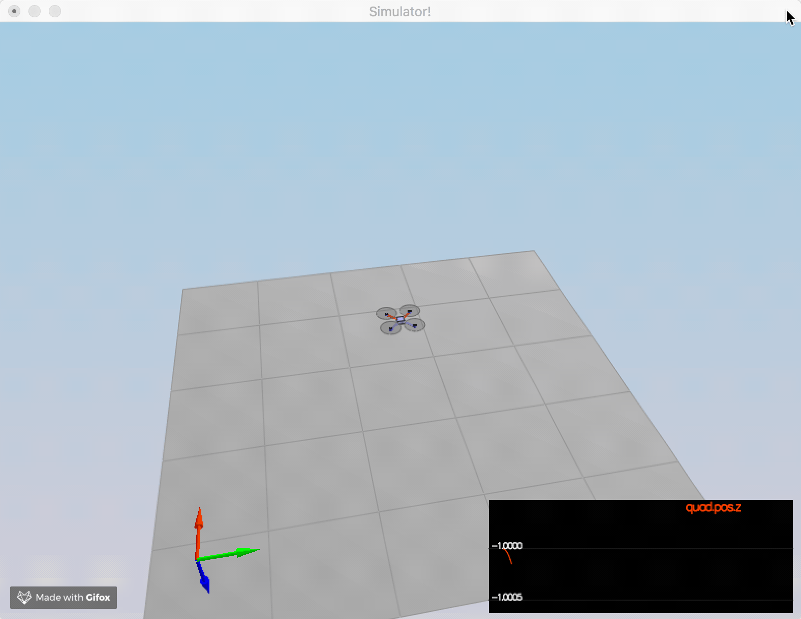
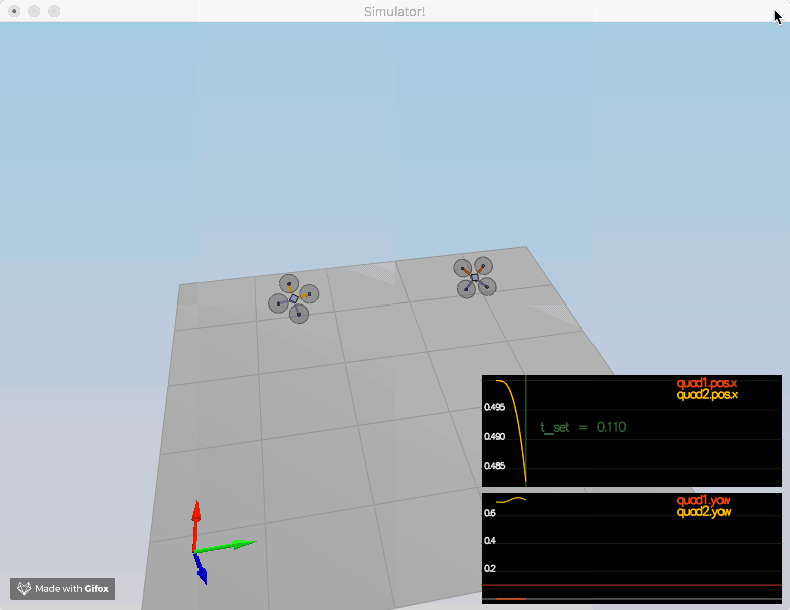
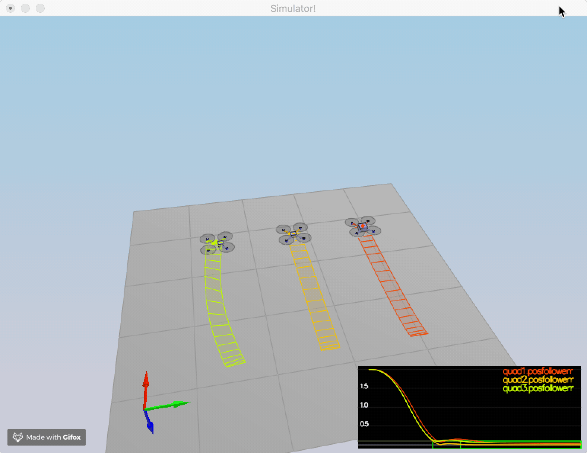
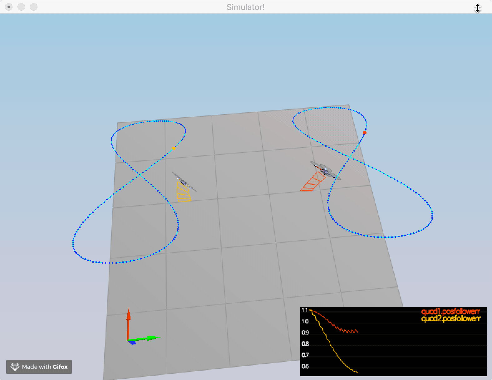
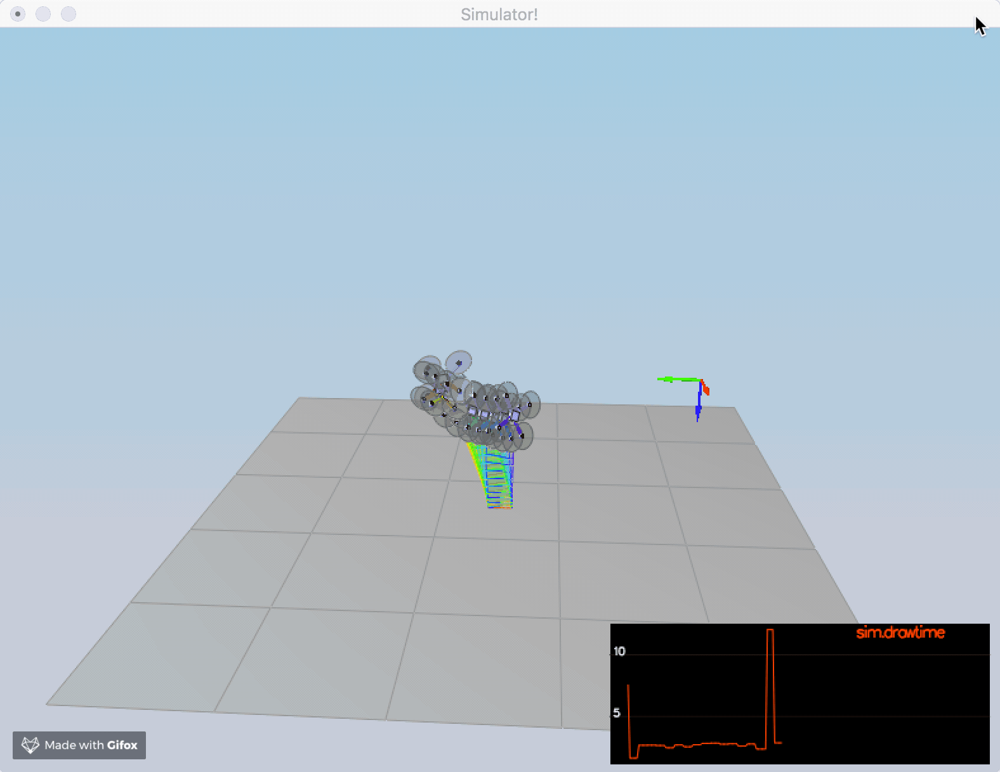
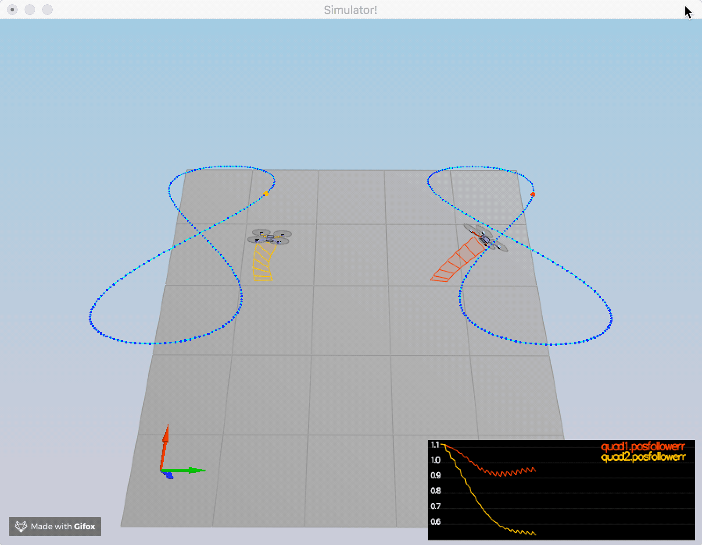

## Project: Control of a 3D Quadrotor

#### Provide a Writeup / README that includes all the rubric points and how you addressed each one. You can submit your writeup as markdown or pdf.

The writeup / README should include a statement and supporting figures / images that explain how each rubric item was addressed, and specifically -where in the code each step was handled.

#### 1.Generate Motor Commands
From the moment in 3 directions and the thrust ( 4 quantities), 

F1 - F2 - F3 + F4 = Mx / l

F1 + F2 - F3 - F4 = My / l

F1 - F2 + F3 - F4 = Mz / l

F1 + F2 + F3 + F4 = thrust

Solve the equation to get the thrusts of 4 mortors.

#### 2.Body Rate Control
We find the error of body rate: ( pqrCmd - pqr )

then calculate the momentCmd from moment of inertia and error of body rate:

momentCmd = I * kpPQR * ( pqrCmd - pqr );

#### 3.Roll Pitch Control
Calculate collective acceleration: c = - collThrustCmd / mass;

using c to find the portion of acceleration: b_cmd = V3F(accelCmd.x/c, accelCmd.y/c, 0.f);

then find the error: b_err = b_cmd - V3F(R(0,2), R(1,2), 0.f);

and get: b_cmd_dot = kpBank * b_err;

Combining b_cmd_dot and R matrix, we get:

pqrCmd.x = (R(1,0) * b_cmd_dot.x - R(0,0) * b_cmd_dot.y) / R(2,2);

pqrCmd.y = (R(1,1) * b_cmd_dot.x - R(0,1) * b_cmd_dot.y) / R(2,2);

#### 4.Altitude Control
We first calculate the error of position and velocity in z direction,

and adjust the accelaration based on the errors:

accelZCmd += KiPosZ * integratedAltitudeError + kpVelZ * (velZCmd - velZ);

then the the thrust = m(g-a)/R(2,2)

#### 5.Lateral Position Control
From the error of position in x & y direction, we adjust the velocity:

velCmd += kpPosXY * (posCmd - pos);

and from the error of velocity, we adjust the acceleration:

accelCmd += kpVelXY * (velCmd - vel);

#### 6.Yaw Control
We calculate the error of yaw and modulo the value in (-pi, +pi),

then get the yawRateCmd value based on the error: yawRateCmd = kpYaw * err;

### Evaluation, run in C++

#### Scenario 1 Intro

#### Scenario 2 Attitude Control

#### Scenario 3 Position Control

#### Scenario 4 Non Idealities

#### Scenario 5 Trajectory Follow

#### Scenario 6 Test Many Quads

#### Scenario 7 Test Mavlink

